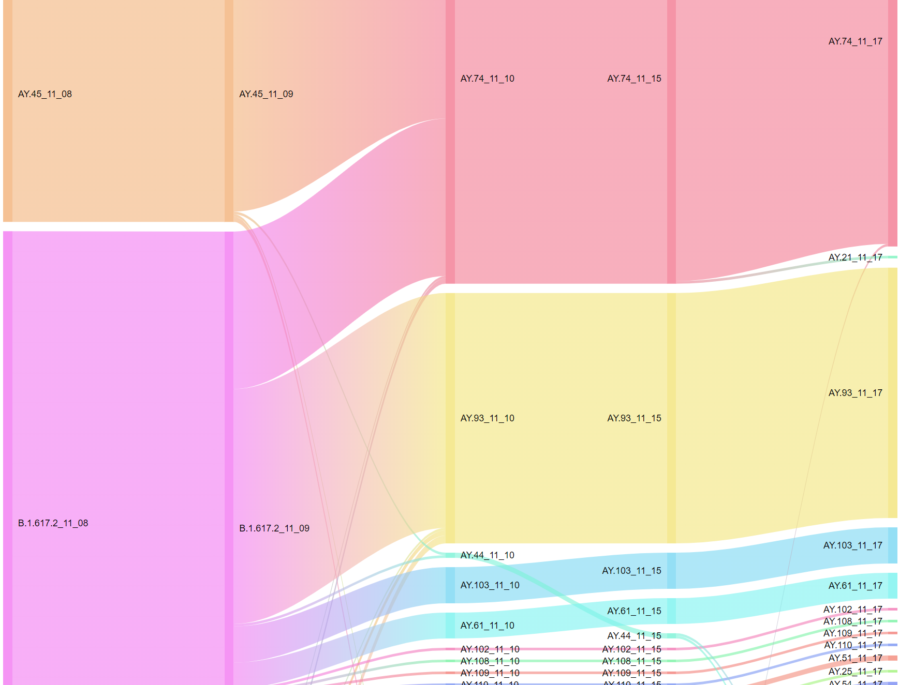

## Reporting Pangolin COVID19 Lineage assignment changes through time 
The Pangoline lineage assignment of a sample can sometimes change through time due to creation of new lineages, changes in the PangoLEARN model, etc.
The markdown file provided can be called to generate the Sankey visualization of changes in Pangolin lineage assignment through time using Google Visualization, and report top changes in counts and proportions of lineages in an html file. Note that this is for examining changes in lineage assignment specifically, and not reflecting the total count of samples available.

### Usage:
  * See the assignmentchange.r file as an example to call the markdown file to generate both the Sankey plot and document report.
  * Lineages of interest can be specified with the linFocus parameter to generate subsetted Sankey plots.

### Input:

  * inputDir = the folder that stores pangolin results from different runs in sub-folders in the "pangolin_analysis_2021_month_day" format, additional characters after 'day' are skipped.
    + (Default: At NML, set the inputDir to be the following folder from Natalie Knox "W:\\Projects\\covid-19\\analysis\\Ongoing_Pangolin_IRIDA_Updates\\")
  
  * outputDir: defaulted to the latest pangolin prediction folder under inputDir
  
  * selectT = the index of the runs to plot. See script below for example
  
  * typeselect = a corresponding output name for the selectT set
  
  * linFocus = NULL 
    + if you wanted to examine changes in samples of all lineages within time points of interest. 
    + Or set linFocus = c("AY.74","B.1.617.2","AY.45") for example if you only want to examine samples that have been assigned to specific lineages. Output name will concatenate the targeted lineages.
  
  * maxSankeyPx = 5000, maximum Sankey pixel in height
  
### Output: 

  * Sankey plot
  * Plots can be seen in the COVID19_assignmentThroughTime_report.html 

  (Examples of the output can be viewed in data\pangolin_analysis_2021_11_17, which was used as the outputDir -- the latest pangolin result folder -- by default.)
  
### Contact
Julie Chih-yu Chen chih-yu.chenATphac-aspc.gc.ca
