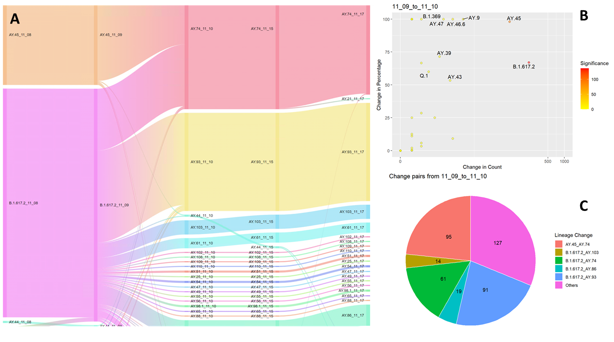

## Reporting Pangolin COVID19 Lineage assignment changes through time 
The Pangoline lineage assignment of a sample can sometimes change through time due to creation of new lineages, changes in the PangoLEARN model, etc.
The markdown file provided can be called to generate the Sankey visualization of changes in Pangolin lineage assignment through time using Google Visualization, and report top changes in counts and proportions of lineages in an html file. Note that this is for examining changes in lineage assignment specifically, and not reflecting the total count of samples available.

### Usage:
  * See the assignmentchange.r file as an example to call the markdown file to generate both the Sankey plot and document report.
  * Lineages of interest can be specified with the linFocus parameter to generate subsetted Sankey plots.

### Input: 
  See the data folder for examples of input format.

  * inputDir = the folder that stores pangolin results from different runs in sub-folders in the "pangolin_analysis_2021_month_day" format, additional characters after 'day' are skipped.
  
  * outputDir = the output direcotory, defaulted to be the latest pangolin prediction folder under inputDir
  
  * selectT = the indices of the runs to plot, all or a subset. See assignmentchange.r for examples.
  
  * typeselect = a corresponding output name for the selectT set
  
  * linFocus = specify the specific lineages to be examined or use NULL for all lineages
    + if you wanted to examine changes in all lineages within time points of interest, set linFocus = NULL 
    + if you only want to examine samples that have been assigned to specific lineages, set linFocus = c("AY.74","B.1.617.2","AY.45") for example. Names of output files will  trail with concatenated targeted lineages for identification
  
  * maxSankeyPx = maximum Sankey pixel in height, default 5000, to avoid excessively long sankey plot
  
### Output: 

  * Sankey plot in HTML
  * Other analytical plots for proportion of changes and flagging lineages can be seen in the COVID19_assignmentThroughTime_report.html 

  (Sample output can be viewed in data\pangolin_analysis_2021_11_17, which was used as the outputDir -- the latest pangolin result folder -- by default.)
  
### Contact
Questions or comments can be directed to Julie Chih-yu Chen chih-yu.chenATphac-aspc.gc.ca
